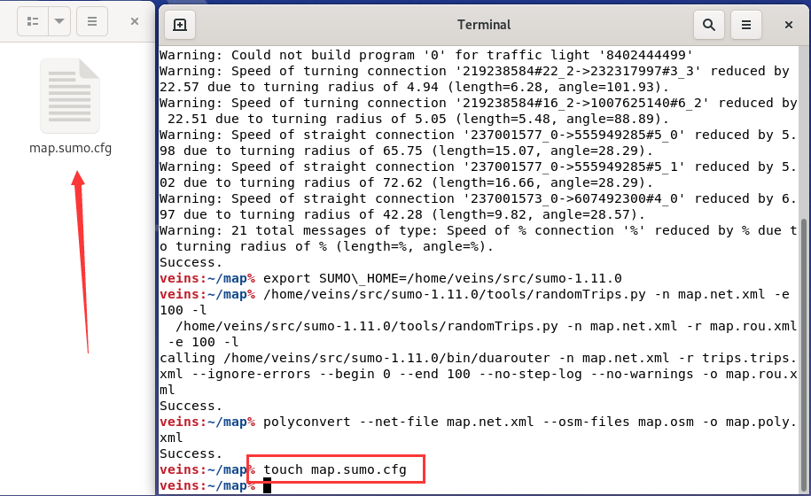

- [1. Veins \& SUMO \& OMNeT++ 车联网仿真平台简介](#1-veins--sumo--omnet-车联网仿真平台简介)
  - [1.1. Veins](#11-veins)
  - [1.2. SUMO](#12-sumo)
  - [1.3. OMNeT++](#13-omnet)
- [2. OMNeT++ 示例代码介绍](#2-omnet-示例代码介绍)
- [3. 仿真地图替换](#3-仿真地图替换)
    - [3.1. 使用netconvert转换工具](#31-使用netconvert转换工具)
    - [3.2. 直接用netedit软件绘制地图](#32-直接用netedit软件绘制地图)
- [4. 常用功能代码编写](#4-常用功能代码编写)
  - [4.1. 发送与接收 WSM 消息](#41-发送与接收-wsm-消息)
  - [4.2. 设置多个RSU](#42-设置多个rsu)
  - [4.3. 获取节点位置和速度](#43-获取节点位置和速度)
  - [4.4. 获取消息的接收功率](#44-获取消息的接收功率)
  - [4.5. 新建一种ReportMessage消息类型](#45-新建一种reportmessage消息类型)
  - [4.6. 修改信道衰落模型](#46-修改信道衰落模型)
  - [4.7. RSU通信范围显示](#47-rsu通信范围显示)
  - [4.8. OMNeT++中链接OpenSSL库](#48-omnet中链接openssl库)
  - [4.9. 自消息/节点自主发消息实现](#49-自消息节点自主发消息实现)
  - [4.10. 控制车辆变更车道](#410-控制车辆变更车道)
- [5. 平台中可能遇到的问题](#5-平台中可能遇到的问题)
  - [5.1. Ubuntu磁盘扩容](#51-ubuntu磁盘扩容)
  - [5.2. 安装中文输入法](#52-安装中文输入法)


## 1. Veins & SUMO & OMNeT++ 车联网仿真平台简介
<div style="text-align: center;">
  
</div>


### 1.1. Veins
<!-- <div style="float: right; margin-left: 10px;">
  
</div -->

Veins是一个用于运行车辆网络模拟的开源框架，包括一套全面的模型，能够模拟车辆通信系统，包括车对车（Vehicle-to-Vehicle，V2V）和车对基础设施（Vehicle-to-Infrastructure，V2I）的通信。Veins通过TCP套接字连接OMNeT++和SUMO。
- Veins官网链接：[https://veins.car2x.org/](https://veins.car2x.org/)

<div style="text-align: center;">
  
</div>


### 1.2. SUMO
SUMO是开源、微观、多模态的交通模拟工具，用于模拟城市交通，如车辆，公共汽车，自行车和行人等。

- SUMO官网链接：[https://eclipse.dev/sumo/](https://eclipse.dev/sumo/)
- SUMO官方文档：[https://sumo.dlr.de/docs/index.html](https://sumo.dlr.de/docs/index.html)

<div style="text-align: center;">
  
</div>


### 1.3. OMNeT++
Veins 使用 OMNeT++ 作为其网络模拟器。OMNeT++ 是一个可扩展的、模块化的、基于组件的C++仿真库和框架，主要用于构建网络模拟器，用来模拟计算机网络、多处理器和分布式系统等。OMNeT++ 提供了一个基于 Eclipse 的 IDE，一个图形运行时环境，以及许多其他工具，用于实时模拟、网络仿真、数据库集成的扩展等。

- OMNeT++官网链接：[https://omnetpp.org/](https://omnetpp.org/)
- OMNeT++官方文档：[https://omnetpp.org/documentation/](https://omnetpp.org/documentation/)

<div style="text-align: center;">
  
</div>

为快速入门此平台仿真，这里推荐一个简易安装版本 `Veins 5.2-i1` ，👉[Veins简易安装教程](Tutorials/Veins_Installation_Tutorial.md)。该手册将基于 `Veins 5.2-i1` 版本示例代码带大家快速入门。

安装好后，输入初始密码`veins`，进入后点击`Activites`，会看到以下界面。
<div style="text-align: center;">
  
</div>

接下来将平台示例代码载入到OMNeT++中，详见👉[OMNeT++导入项目教程](Tutorials/OMNeTpp_Project_Import_Guide.md)，示例工程路径`~/Home/src/veins`。


## 2. OMNeT++ 示例代码介绍

该部分对 OMNeT++ 示例代码中各文件功能或定义进行了简单介绍。

**（1）veins->examples->veins 下各文件**
- **results 文件夹**：用于存储模拟运行后生成的所有输出和日志文件。
 
  - Scalar files (.sca)：这些文件包含了模拟结束时的统计信息，例如发送和接收的包的数量，延迟的平均值和标准差等。
  - Vector files (.vec)：这些文件包含了模拟过程中记录的时间序列数据，例如每个包的发送和接收时间，每个节点的位置等。
  - Eventlog files (.elog)：如果你启用了事件日志记录，这些文件会包含模拟过程中所有的事件详细信息。这些文件可以用 OMNeT++ 的 Sequence Chart 工具来查看。
  - Log files (.log)：这些文件包含了模拟过程中的日志信息，例如错误和警告信息。

- **antenna.xml**：用于定义和配置无线通信中的天线模型。（一般用不到）

- **config.xml**：用于配置模拟的无线信号传播和接收模型的物理特性。
    
    AnalogueModels 部分包含两个 AnalogueModel：SimplePathlossModel 和 SimpleObstacleShadowing。

    SimplePathlossModel 有一个 alpha 参数，值为 2.0。alpha 通常用于描述路径损失模型中的路径损失指数，它是一个描述随着距离增加，信号强度如何衰减的参数。

    SimpleObstacleShadowing 是一个描述物体（如建筑物）对无线信号造成阴影效应的模型。这里定义了一种类型的障碍物 building，并给出了每次穿越和每米对信号强度造成的衰减。

    Decider 部分定义了一个类型为 Decider80211p 的决策器。决策器在无线通信中通常用于决定在给定的信号和噪声条件下，是否可以成功接收一个包。在这里，Decider80211p 有一个 centerFrequency 参数，值为 5.890e9，这个参数可能表示决策器监听的中心频率。
  
- **erlangen.launchd.xml**：用于配置 SUMO 模拟器的启动参数。通过修改这个文件，你可以改变模拟的输入、时间参数、报告设置和 GUI 行为，从而影响模拟的行为和结果。

- **erlangen.net.xml**：描述了道路网络的结构，构成了车辆运动的基础框架，包括各种道路、交叉口及相关交通标志信息。

- **erlangen.poly.xml**：描绘了非道路元素，如建筑物、树木或其他地理特征。这些元素虽不直接影响交通流动，但对于创建更加真实的仿真环境至关重要。

- **erlangen.rou.xml**：描述了车辆的行驶路线。这里提供了车流（flow）控制的方法，形成车辆队列。
    
````xml
<routes>
<vType id="vtype0" accel="2.6" decel="4.5" sigma="0.5" length="2.5" minGap="2.5" maxSpeed="14" color="1,1,0"/>
<route id="route0" edges="-39539626 -5445204#2 -5445204#1 113939244#2 -126606716 23339459 30405358#1 85355912 85355911#0 85355911#1 30405356 5931612 30350450#0 30350450#1 30350450#2 4006702#0 4006702#1 4900043 4900041#1"/>
<flow id="flow0" type="vtype0" route="route0" begin="0" period="3" number="195"/>
</routes>
````

在提供的XML片段中，定义了车辆类型、路线以及流量，这些是在使用SUMO进行交通仿真时常用的元素。各个部分的含义和作用如下：

- **vType**：定义一种车辆类型。
    - `id="vtype0"`：车辆类型的标识符。
    - `accel="2.6"`：车辆的最大加速度，单位为米/秒²。
    - `decel="4.5"`：车辆的最大减速度，单位为米/秒²。
    - `sigma="0.5"`：驾驶员的驾驶不确定性，影响驾驶行为的随机性。
    - `length="2.5"`：车辆的长度，单位为米。
    - `minGap="2.5"`：车辆间的最小间隔，单位为米。
    - `maxSpeed="14"`：车辆的最大速度，单位为米/秒。
    - `color="1,1,0"`：车辆在仿真中的显示颜色，这里是黄色（RGB颜色代码）。

- **route**：定义了一条路线。
    - `id="route0"`：路线的标识符。
    - `edges`：路线经过的边的序列。这些边是道路网络中定义的路段，车辆将按照这些路段行驶。

- **flow**：定义了车辆流。
    - `id="flow0"`：流的标识符。
    - `type="vtype0"`：指定流使用的车辆类型（与上文定义的vType相对应）。
    - `route="route0"`：指定流使用的路线（与上文定义的route相对应）。
    - `begin="0"`：流开始的时间，单位为秒。
    - `period="3"`：发车间隔，即每隔多少秒发一辆车。
    - `number="195"`：总共发车的数量。

如果仿真需要修改车流行驶路线，可以在 `netedit` 中打开 `***.net.xml` 路网文件获取道路id，按照道路顺序（注意车辆行驶方向）将 `route id` 填入相应为位置，即可生成一组具有相同特性（例如车辆类型、路线、发车时间等）的车辆。以修改地图路径为 `Home/src/veins/examples/veins/***.sumo.cfg` 的车流行驶路线为例，详细步骤如下：

- 在`Home/src/veins/examples/veins`右键打开终端，键入

```shell
$ sumo-gui map.sumo.cfg
```

- 选择`Edit`下的`Open in netedit`


- 查看预设路线上的所有路径id（每两个结点之间的单个方向具有一个id，不同行驶方向具有不同id）


- 将选择的路线按照车流行驶顺序修改相应的`***.rou.xml`

- **erlangen.sumo.cfg**：定义 SUMO 模拟的输入文件、模拟的时间参数、报告设置以及 GUI 的行为。\<input>：这部分定义了模拟的输入文件。\<time>：这部分定义了模拟时间的参数(开始时间、结束时间、时间步长)。\<report>：这部分定义了模拟报告的设置。\<gui_only>：这部分定义了 GUI 的行为。

- **omnetpp.ini**：用于配置模拟参数的文件。在这个文件中，你可以定义和配置各种模拟参数，例如模拟的持续时间，所使用的网络模型，模块参数，随机数生成器的种子，等等。

- **RSUExampleScenario.ned**：描述了一个名为 RSUExampleScenario 的网络，该网络扩展自 Scenario 类，并包含一个 RSU 类型的子模块。更改仿真场景RSU数量时需要修改此文件，源代码如下：

**（2）veins->src->veins->modules->applicaton->traci下各文件（主要在该目录下编写仿真代码）**

- **TraCIDemo11p.ned**：定义了一个名为 TraCIDemo11p 的简单模块，用于模拟车辆的应用层功能。该模块可以进行处理和发送基于车载网络的消息。

- **TraCIDemo11p.h**：当汽车停止超过 10 秒时，它会向其他汽车发送一条包含阻塞道路 ID 的消息。 然后接收车辆将通过 TraCI 触发重新路线。 当 MAC 上启用 SCH 和 CCH 之间的信道切换时，消息将在 CCH 上的服务通告之后在服务信道上发送。

````cpp
#pragma once

#include "veins/modules/application/ieee80211p/DemoBaseApplLayer.h"

namespace veins {

class VEINS_API TraCIDemo11p : public DemoBaseApplLayer {
public:
    void initialize(int stage) override;  // 初始化

protected:
    simtime_t lastDroveAt;
    bool sentMessage;
    int currentSubscribedServiceId;

protected:
    void onWSM(BaseFrame1609_4* wsm) override;  // 处理 WSM 消息
    void onWSA(DemoServiceAdvertisment* wsa) override;  // 处理 WSA 消息

    void handleSelfMsg(cMessage* msg) override;   // 处理自消息
    void handlePositionUpdate(cObject* obj) override; // 车辆位置更新时相关处理
};

}
````

- **TraCIDemo11p.cc**：车辆行为控制，主要目的是演示如何在车载网络中使用和处理消息。该模块实现了一个简单的车辆通信协议，其中车辆会定期广播其位置信息，并且可以处理接收到的其他车辆的位置信息。代码解释如下：

````cpp
// 对于每个模块，initialize 方法会被调用多次，每个阶段（stage）分别对应不同的初始化任务。

void TraCIDemo11p::initialize(int stage)
{
    DemoBaseApplLayer::initialize(stage);   // 调用父类 DemoBaseApplLayer 的 initialize 方法
    if (stage == 0) {   // 阶段 0 通常用于设置模块的内部状态和参数
        sentMessage = false;  // 表示这个模块尚未发送任何消息
        lastDroveAt = simTime();  // simTime()用于读取当前仿真时间，表示最后一次驾驶的时间
        currentSubscribedServiceId = -1;  // 表示当前没有订阅任何服务
    }
}
````

````cpp
// onWSA 方法的作用是处理收到的 WSA（Wave Service Advertisement）服务广告消息。
// 示例代码功能：当收到一个 WSA 消息时，如果当前没有订阅任何服务，或者当前提供的服务与 WSA 消息中的服务不同，则会改变服务频道，并订阅 WSA 消息中的服务

void TraCIDemo11p::onWSA(DemoServiceAdvertisment* wsa)
{
    // 检查当前是否已经订阅了某个服务。值为 -1，则表示当前没有订阅任何服务。
    if (currentSubscribedServiceId == -1) {   
        //改变当前的服务频道
        mac->changeServiceChannel(static_cast<Channel>(wsa->getTargetChannel()));
        // 将 WSA 消息中的 PSID （Provider Service Identifier）设置为当前订阅的服务 ID。
        currentSubscribedServiceId = wsa->getPsid();  
        // 检查当前提供的服务 ID 是否与 WSA 消息中的 PSID 相同。
        if (currentOfferedServiceId != wsa->getPsid()) {
            stopService();  // 停止当前的服务
            // 启动新的服务。
            startService(static_cast<Channel>(wsa->getTargetChannel()), wsa->getPsid(), "Mirrored Traffic Service");
        }
    }
}
````

````cpp
// onWSM 方法的作用是处理收到的 WSM（Wave Short Message）消息。
// 示例代码功能：当收到一个 WSM 时，如果这是第一次收到消息，则会发送一条新的消息；同时，如果路线 ID 不以 ':' 开头，还会改变路线

void TraCIDemo11p::onWSM(BaseFrame1609_4* frame)
{
    TraCIDemo11pMessage* wsm = check_and_cast<TraCIDemo11pMessage*>(frame);

    // 表示车辆接收到了一个消息时在 OMNeT++ 的 GUI 中改变模块的颜色。
    findHost()->getDisplayString().setTagArg("i", 1, "green");

    // 检查当前的路线 ID 是否以 ':' 开头。如果不是，就调用 traciVehicle->changeRoute 方法改变路线。
    if (mobility->getRoadId()[0] != ':') traciVehicle->changeRoute(wsm->getDemoData(), 9999);
    if (!sentMessage) {
        sentMessage = true;
        // repeat the received traffic update once in 2 seconds plus some random delay
        wsm->setSenderAddress(myId);  // 设置消息的发送者地址
        wsm->setSerial(3);    // 设置消息的发送者序列号
        scheduleAt(simTime() + 2 + uniform(0.01, 0.2), wsm->dup());
    }
}
````

````cpp
// 用于处理自消息。
// 示例代码功能：到一个 TraCIDemo11pMessage 时，会发送一个复制的消息，然后增加消息的序列号，如果序列号大于或等于3，则停止服务并删除这条消息；否则，安排一个事件，在未来的某个时间再次发送这条消息。对于不是 TraCIDemo11pMessage 的消息，将其交给父类处理。

void TraCIDemo11p::handleSelfMsg(cMessage* msg)
{
    if (TraCIDemo11pMessage* wsm = dynamic_cast<TraCIDemo11pMessage*>(msg)) {
        // send this message on the service channel until the counter is 3 or higher.
        // this code only runs when channel switching is enabled
        sendDown(wsm->dup());
        wsm->setSerial(wsm->getSerial() + 1);
        if (wsm->getSerial() >= 3) {
            // stop service advertisements
            stopService();
            delete (wsm);
        }
        else {
            scheduleAt(simTime() + 1, wsm);
        }
    }
    else {
        DemoBaseApplLayer::handleSelfMsg(msg);
    }
}
````

````cpp
// 位置更新时被调用
// 示例代码功能：当位置更新时，根据车辆的速度和是否已经发送过消息来决定是否需要发送一个新的消息，以及怎么发送这个消息。

void TraCIDemo11p::handlePositionUpdate(cObject* obj)
{
    DemoBaseApplLayer::handlePositionUpdate(obj);

    // stopped for for at least 10s?
    if (mobility->getSpeed() < 1) {
        if (simTime() - lastDroveAt >= 10 && sentMessage == false) {
            findHost()->getDisplayString().setTagArg("i", 1, "red");
            sentMessage = true;

            TraCIDemo11pMessage* wsm = new TraCIDemo11pMessage();
            populateWSM(wsm);
            wsm->setDemoData(mobility->getRoadId().c_str());  // 设置消息内容为当前的路线 ID

            // host is standing still due to crash
            if (dataOnSch) {
                startService(Channel::sch2, 42, "Traffic Information Service");
                // started service and server advertising, schedule message to self to send later
                scheduleAt(computeAsynchronousSendingTime(1, ChannelType::service), wsm);
            }
            else {
                // send right away on CCH, because channel switching is disabled
                sendDown(wsm);  // 发送消息
            }
        }
    }
    else {
        lastDroveAt = simTime();
    }
}
````

- **TraCIDemoRSU11p.ned**：定义了一个名为 TraCIDemoRSU11p 的简单模块，用于模拟路侧单元（RSU）的功能。这个模块可以用于处理和发送基于车载网络的消息。源代码如下：

````Java
package org.car2x.veins.modules.application.traci;
import org.car2x.veins.modules.application.ieee80211p.DemoBaseApplLayer;

simple TraCIDemoRSU11p extends DemoBaseApplLayer
{
    @class(veins::TraCIDemoRSU11p);   // 用于指定与该模块相关联的 C++ 类
    @display("i=block/app2");   // 指定在 OMNeT++ GUI 中显示模块的图标。
}
````

- **TraCIDemoRSU11p.cc**：路测单元RSU行为控制。

````c++
#include "veins/modules/application/traci/TraCIDemoRSU11p.h"

#include "veins/modules/application/traci/TraCIDemo11pMessage_m.h"

using namespace veins;

Define_Module(veins::TraCIDemoRSU11p);

void TraCIDemoRSU11p::onWSA(DemoServiceAdvertisment* wsa)
{
    // if this RSU receives a WSA for service 42, it will tune to the chan
    if (wsa->getPsid() == 42) {
        mac->changeServiceChannel(static_cast<Channel>(wsa->getTargetChannel()));
    }
}

void TraCIDemoRSU11p::onWSM(BaseFrame1609_4* frame)
{
    TraCIDemo11pMessage* wsm = check_and_cast<TraCIDemo11pMessage*>(frame);

    // this rsu repeats the received traffic update in 2 seconds plus some random delay
    sendDelayedDown(wsm->dup(), 2 + uniform(0.01, 0.2));
}
````

- **TraCIDemoRSU11p.h**

````c++
#pragma once

#include "veins/modules/application/ieee80211p/DemoBaseApplLayer.h"

namespace veins {

/**
* Small RSU Demo using 11p
*/
class VEINS_API TraCIDemoRSU11p : public DemoBaseApplLayer {
protected:
    void onWSM(BaseFrame1609_4* wsm) override;
    void onWSA(DemoServiceAdvertisment* wsa) override;
};

} // namespace veins
````

- **MyVeinsApp.ned**

  定义了一个名为 MyVeinsApp 的简单模块，用于模拟车辆的应用层功能。这个模块可以进行处理和发送基于车载网络的消息。同时，该模块有一个参数 appName，可以在实例化该模块时进行设置，以标识或描述该模块的作用。
````Java
package org.car2x.veins.modules.application.traci;
import org.car2x.veins.modules.application.ieee80211p.DemoBaseApplLayer;

//
// network description file for your Veins Application. Add parameters here
//
simple MyVeinsApp extends DemoBaseApplLayer
{
    @class(veins::MyVeinsApp);
    string appName = default("My first Veins App!");
}
````

- **MyVeinsApp.cc**
  
````c++
      // Initializing members and pointers of your application goes here
      EV << "Initializing " << par("appName").stringValue() << std::endl;
````

- **MyVeinsApp.h**

````c++
#pragma once

#include "veins/veins.h"

#include "veins/modules/application/ieee80211p/DemoBaseApplLayer.h"

using namespace omnetpp;

namespace veins {

class VEINS_API MyVeinsApp : public DemoBaseApplLayer {
public:
    void initialize(int stage) override;
    void finish() override;

protected:
    void onBSM(DemoSafetyMessage* bsm) override;
    void onWSM(BaseFrame1609_4* wsm) override;
    void onWSA(DemoServiceAdvertisment* wsa) override;

    void handleSelfMsg(cMessage* msg) override;
    void handlePositionUpdate(cObject* obj) override;
};

} // namespace veins
````


- **TraCIDemo11pMessage.msg**：定义了一个 Veins 中的包，这个包可以在车载网络模拟中用于传输数据。

````Java
import veins.base.utils.Coord;
import veins.modules.messages.BaseFrame1609_4;
import veins.base.utils.SimpleAddress;

namespace veins;

packet TraCIDemo11pMessage extends BaseFrame1609_4 {
    string demoData;
    LAddress::L2Type senderAddress = -1;
    int serial = 0;
}
````

- **TraCIDemo11pMessage_m.cc** 

- **TraCIDemo11pMessage_m.h**


## 3. 仿真地图替换
在使用SUMO进行交通仿真时，经常需要根据研究需求更换不同的地图。下面介绍一下如何进行地图替换。首先，需要知道，SUMO仿真器跑起来需要有三个文件:

- `***.net.xml`文件：描述路网结构；
- `***.rou.xml`文件：描述车辆行驶路线；
- `***.sumo.cfg`文件：描述仿真配置。

SUMO 中路网文件的编写可以手动编写，也可以用 `netconvert` 命令转换第三方来源中的复杂路网。总体包括道路、交叉口的id和位置信息、车道信息（数量、长度、最大速度、形状、功能等）、优先权信息、交通信号信息、交叉口信息等。下面介绍了两种生成SUMO路网文件的方法。

#### 3.1. 使用netconvert转换工具

通过在终端中输入 netconvert 命令，能够将多种第三方的路网文件（如.osm文件）转化为 SUMO 可读的文件，具体可转化的第三方来源有：OpenStreetMap、PTV Vissim、OpenDrive、MATsim、ArcView等。下面将以OpenStreetMap为例进行过程描述。

- `***.osm`文件生成
首先进入 OpenStreetMap 官网：[https://www.openstreetmap.org/](https://www.openstreetmap.org/)，按下图步骤选择区域并导出 `map.osm` 文件；


将导出的文件拷贝到平台Home路径的某个文件夹中，再利用 sumo/bin 目录下的netconvert、polyconvert 转换工具和 sumo/tools 目录下的 `randomTrips.py` 工具生成相应的 SUMO 仿真文件。具体步骤如下：

- `***.net.xml` 道路文件生成

  打开终端
  
  输入以下内容生成道路文件
  ````
  netconvert --osm-files map.osm -o map.net.xml
  ````
  
  其中，`netconvert`命令可以将 `***.osm` 文件转换成 `***.net.xml` 文件，`--osm-files` 即表示输入文件类型， `-o map.net.xml` 是输出， `-o` 即 output 的意思，`map.net.xml`即为输出文件。

  如果出现以下警告
  
  

  是因为我们需要配置一个临时环境变量，由于版本 `Veins 5.2-i1` 内的SUMO版本是sumo-1.11.0，所以在终端输入以下内容配置临时环境

  ````
  export SUMO\_HOME=/home/veins/src/sumo-1.11.0
  ````

- `***.rou.xml` 车辆行为文件生成

  由于车辆的行为是多种多样的，所以可以利用 SUMO中 的 `randomTrips.py` 脚本根据道路状况随机化车辆行为生成相应的 `***.rou.xml` 文件。在终端输入以下内容将道路和行驶路径整合生成车辆行为文件

  ````
  /home/veins/src/sumo-1.11.0/tools/randomTrips.py -n map.net.xml -e 100 -l
  /home/veins/src/sumo-1.11.0/tools/randomTrips.py -n map.net.xml -r map.rou.xml -e 100 -l
  ````
  

  也可以类似示例代码 `erlangen.rou.xml` 文件中使用 \<flow> 元素定义一组具有相同特性（例如车辆类型、路线、发车时间等）的车辆队列。

- `***.poly.xml` 地形文件生成

  因为在 Veins 仿真过程中，将用到地形文件。`polyconvert` 转换工具可以根据 `***.net.xml` 和 `***.osm` 文件生成相应的地形文件。在终端输入以下内容生成地形文件

  ````
  polyconvert --net-file map.net.xml --osm-files map.osm -o map.poly.xml
  ````

  

- `***.sumo.cfg` 配置文件生成

  使用`touch`命令，新建一个 `map.sumo.cfg` 文件，编写内容如下

  ````
  <?xml version="1.0" encoding="iso-8859-1"?>

  <configuration xmlns:xsi="http://www.w3.org/2001/XMLSchema-instance" xsi:noNamespaceSchemaLocation="http://sumo.sf.net/xsd/sumoConfiguration.xsd">

  <input>
      <net-file value="map.net.xml"/>
      <route-files value="map.rou.xml"/>
      <additional-files value="map.poly.xml"/>
  </input>

  <time>
      <begin value="0"/>
      <end value="1000"/>
      <step-length value="0.1"/>
  </time>

  <report>
      <no-step-log value="true"/>
  </report>

  <gui_only>
      <start value="true"/>
  </gui_only>

  </configuration>
  ````
  

- 开启可视化界面

  在终端输入以下内容

  ````
  sumo-gui map.sumo.cfg
  ````

  此时会打开 SUMO 的 GUI，按下图操作观察 SUMO 车辆行为仿真。

  

  

  如果需要对地图进行小部分修改，可以点击 `Edit->Open in netedit`，删除原理也很简单，选中道路边缘红点，按DEL键删除即可。

  

  

  

  **注意**：修改之后，意味着 `***.net.xml` 道路文件发生变化，需要重新生成车辆行为文件，地形文件避免报错。
    <div style="text-align: center;">
    
    </div>

  注意：假设仿真过程中，有的道路无法通车，因此需要修改车辆类型和允许通行的类型（可以是行人），操作如下
  

  如果地图太大，边缘多余道路、地铁线等，由于 netedit 不能选择一片区域进行删除，我们可以使用 JSOM 软件（[https://josm.openstreetmap.de/](https://josm.openstreetmap.de/)）进行对osm文件进行地图编辑，之后重新生成车辆行为文件即可。

- 加载地图到 Veins 中

  复制路网文件（map.net.xml）、车辆行为文件（map.rou.xml）、地形文件（map.poly.xml）、配置文件（map.sumo.cfg）到 OMNeT++ 示例项目的 `Veins -> examples -> veins` 路径下，同时修改 `erlangen.launchd.xml` 和 `erlangen.sumo.cfg` 中的相应内容，如下:

  

    
  
  
  或者重新生成 `map.launchd.xml` 和 `map.sumo.cfg` 文件，并在 `omnetpp.ini` 文件中修改相应内容，如下：
   

  运行 `omnetpp.ini` 文件，如果刚运行就出现如下错误：
  
  
  
  说明无法成功连接到 TraCI（Traffic Control Interface）服务器，TraCI 服务器是 SUMO 交通模拟器的一部分。这时只需要点击 `Activities->veins_launchd` 打开，出现如下界面即可再次运行 `omnetpp.ini`。
  <div style="text-align: center;">
    
    </div>

    <div style="text-align: center;">
    
    </div>

  <div style="text-align: center;">
    
    </div>
  
  
  运行后如遇到下述情况，则需要在 `omnetpp.ini` 文件中修改仿真区域范围大小：
  <div style="text-align: center;">
    
    </div>

    <div style="text-align: center;">
    
    </div>

#### 3.2. 直接用netedit软件绘制地图

- **路网编辑：**
  
  以生成一个九宫格地图（2k×2k）为例。打开 netedit 软件，通过选择 File->New Network 创建一个新网络，并确保Network被选中。

  - 进入netedit：`...\sumo\bin\netedit.exe`
  - 创建网络：选择 File->New Network 创建一个新网络
  - 创建节点和边并修改属性：edge mode->（创建多个节点打开chain mode 模式）->inspect mode修改属性
  
    

    

  - 添加反向车道：鼠标右键边->Edge operations->Add reverse direction for edge

    

    

  - 根据需求 create TLS
  
  - 路网保存

    

    将保存的 `***.net.xml` 文件复制到 Veins，之后的操作参照方法1，但是由于没有建筑物等，不用生成地形文件 `***.poly.xml`，在 `***.sumo.cfg` 文件中删除 `<additional-files value="***.poly.xml"/>`。

    最后，在终端输入 `sumo-gui ***.sumo.cfg`，运行效果如下：

    


## 4. 常用功能代码编写
### 4.1. 发送与接收 WSM 消息
- 发送 WSM 消息
  新建一条WSM消息并广播，代码如下：

  ````c++
  TraCIDemo11pMessage* newWSM = new TraCIDemo11pMessage();
  populateWSM(newWSM);
  std::string newWSM_str = "A new WSM type message.";
  newWSM->setSenderAddress(myId);
  newWSM->setDemoData(newWSM_str.data());
  sendDown(newWSM->dup());
  std::cout << this->myId << ": " << newWSM->getDemoData() << std::endl;
  ````  
  效果如下：

  

  仿真结束后，会出现一堆这种这个，原因在于newWSM对象在模拟结束时没有被正确释放或删除，导致内存泄漏。
  ```
  undisposed object: (veins::TraCIDemo11pMessage) RSUExampleScenario.node[7].appl. -- check module destructor
  undisposed object: (veins::TraCIDemo11pMessage) RSUExampleScenario.node[7].appl. -- check module destructor
  undisposed object: (veins::TraCIDemo11pMessage) RSUExampleScenario.node[7].appl. -- check module destructor
  ```
  可以使用 delete 来释放这个对象占用的内存，即
  ```
  delete newWSM; 
  ```

    然而，在仿真过程中，我们偶尔会遇到同时由多节点发送消息的情况，如果通过`sendDown(newWSM->dup())`来直接发送消息可能会导致消息的接收率降低，原因在于消息包可能会互相冲突。鉴于OMNeT++基于事件驱动的机制，我们可以利用内置的函数`DemoBaseApplLayer::sendDelayedDown(cMessage* msg, simtime_t delay)`来缓解这一问题。具体思路是为每条消息引入一定的随机延时，示例如下：

    ```cpp
    TraCIDemo11pMessage* newWSM = new TraCIDemo11pMessage();
    populateWSM(newWSM);
    std::string newWSM_str = "A new WSM type message.";
    newWSM->setSenderAddress(myId);
    newWSM->setDemoData(newWSM_str.data());
    //sendDown(newWSM->dup());
    sendDelayedDown(newWSM->dup(), uniform(0.01, 0.1)); //设置一个随机时延uniform(0.01, 0.1)避免冲突。
    ```


- 接收 WSM 消息
  
  代码如下：

  ````c++
  void TraCIDemo11p::onWSM(BaseFrame1609_4* frame)
  {
      TraCIDemo11pMessage* wsm = check_and_cast<TraCIDemo11pMessage*>(frame);

      std::string revWSM_str = wsm->getDemoData();
      std::cout << "Car[" << this->myId << "] recieve the car[" 
                << wsm->getSenderAddress() << "] message:" << revWSM_str << std::endl;
  }
  ````  
   效果如下：

  

### 4.2. 设置多个RSU
  
  在设计我们的仿真场景时，我们可能会涉及到多个 RSU，需要在 `veins->examples->veins->RSUExampleScenario.ned` 文件中设置RSU 数量，并且在 `veins->examples->veins->omnetpp.ini` 文件中设置每个 RSU 相对于地图中的位置。例如在示例场景中简单设置 2 个 RSU，代码如下：

  ````ini
  # veins->examples->veins->omnetpp.ini 文件中

  ##########################################################
  #                       RSU SETTINGS                     #
  #                                                        #
  #                                                        #
  ##########################################################
  *.rsu[0].mobility.x = 2000
  *.rsu[0].mobility.y = 2000
  *.rsu[0].mobility.z = 3

  *.rsu[1].mobility.x = 1500
  *.rsu[1].mobility.y = 1600
  *.rsu[1].mobility.z = 3

  *.rsu[*].applType = "TraCIDemoRSU11p"
  *.rsu[*].appl.headerLength = 80 bit
  *.rsu[*].appl.sendBeacons = false
  *.rsu[*].appl.dataOnSch = false
  *.rsu[*].appl.beaconInterval = 1s
  *.rsu[*].appl.beaconUserPriority = 7
  *.rsu[*].appl.dataUserPriority = 5
  *.rsu[*].nic.phy80211p.antennaOffsetZ = 0 m
  ```` 

  ````Java
  // veins->examples->veins->RSUExampleScenario.ned 文件中

  network RSUExampleScenario extends Scenario
  {
    submodules:
        rsu[2]: RSU {
            @display("p=150,140;i=veins/sign/yellowdiamond;is=vs");
        }
  }
  ````  
  效果如下：

  

### 4.3. 获取节点位置和速度
- 获取节点位置
  
   `veins->src->veins->modules->application->traci->TraCIDemo11p.cc` 或 `MyVeinsApp.cc` 中可以通过如下指令获取车辆位置。例如在 `TraCIDemo11p.cc` 中通过函数 `void TraCIDemo11p::handlePositionUpdate(cObject* obj)` 控制车辆在每次位置更新时输出位置，代码如下:

  ````c++
  std::cout << "Car[" << this->myId << "] curPosition" << this->curPosition << std::endl;
  std::cout << "Car[" << this->myId << "] curPosition.x" << this->curPosition.x << std::endl;
  std::cout << "Car[" << this->myId << "] curPosition.y" << this->curPosition.y << std::endl;
  std::cout << "Car[" << this->myId << "] curPosition.z" << this->curPosition.z << std::endl;
  ````  

  效果如下：

  

- 获取节点速度

  首先需在 `omnetpp.ini` 文件中对 Mobility 部分进行如下修改，否则车辆节点获取不到车辆速度，导致输出速度为 (0,0,0)：
  

  获取速度代码与获取位置类似，代码如下：

  ````c++
  std::cout << "Car[" << this->myId << "] curSpeed " << this->curSpeed << std::endl;
  std::cout << "Car[" << this->myId << "] curSpeed.x " << this->curSpeed.x << std::endl;
  std::cout << "Car[" << this->myId << "] curSpeed.y " << this->curSpeed.y << std::endl;
  std::cout << "Car[" << this->myId << "] curSpeed.z " << this->curSpeed.z << std::endl;
  ````  
  效果如下

  


### 4.4. 获取消息的接收功率
  
在进行 Sybil 攻击检测仿真时，计算接收信号强度（RSSI）需要用到消息的接收功率，获取接收功率代码如下：

````c++
// 头文件
#include "veins/base/phyLayer/PhyToMacControlInfo.h"
#include "veins/modules/phy/DeciderResult80211.h"

// 代码
double curRecvPower_dBm = check_and_cast<DeciderResult80211*>(check_and_cast<PhyToMacControlInfo*>(rewsm->getControlInfo())->getDeciderResult())->getRecvPower_dBm();  //  rewsm 表示接收的一条WSM消息
std::cout << "curRecvPower_dBm = " << curRecvPower_dBm << " dBm." << std::endl;
````  

效果如下：


参考链接：[https://www.coder.work/article/6774522](https://www.coder.work/article/6774522)

### 4.5. 新建一种ReportMessage消息类型
- 首先需自定义一个 ReportMessage，可以在 `veins/src/veins/modules/messages` 路径下新建一个 `ReportMessage.msg` 文件，代码内容如下：
  
  ```java
  import veins.base.utils.Coord;
  import veins.modules.messages.BaseFrame1609_4;
  import veins.base.utils.SimpleAddress;

  namespace veins;

  packet ReportMessage extends BaseFrame1609_4 {
      Coord senderPos;
      LAddress::L2Type senderAddress = -1;
  }
  ```
  ReportMessage 继承了 BaseFrame1609_4 并包含两个属性分别是 Coord 类型的发送者所标，以及 L2Type 的发送者 ID。编译之后同目录下生成同名 .h 和 .cc 文件。BaseFrame 为最基础的消息帧，只包含几个基础属性，便于自定义。

- 接下来需要在 `/veins/src/veins/modules/application/ieee80211p/` 路径下修改添加如下代码：
  - 在 `DemoBaseApplLayer.h ` 的 protected 成员中添加：
  ```cpp
  #include "veins/modules/messages/ReportMessage_m.h"

  /** @brief this function is called upon receiving a ReportMessage */
  virtual void onRM(ReportMessage* rm){};
  ···
  uint32_t receivedRMs;
  ···
  ```  

  - 在 `DemoBaseApplLayer.cc ` 中添加：
  ```cpp
  #include "veins/modules/messages/ReportMessage_m.h"

  void DemoBaseApplLayer::handleLowerMsg(cMessage* msg)
  {

      ···
      else if (ReportMessage* rm = dynamic_cast<ReportMessage*>(wsm)) {
          receivedRMs++;
          onRM(rm);
      }
      ···
  }
  ``` 
  
- 之后就可以类似收发 WSM 类型消息一样，如发 ReportMessage，示例如下：

  ```cpp
  ReportMessage* rm = new ReportMessage();
  populateWSM(rm);
  rm->setSenderAddress(myId);
  sendDown(rm->dup());
  ```
  收消息时自定义一个成员函数：
  ```cpp
  // ***.h 头文件中
  ···
  void onRM(ReportMessage* fram) override;
  ···

  // ***.cc 中
  void TraCIDemoRSU11p::onRM(ReportMessage* frame)
  {
      ReportMessage* rm = check_and_cast<ReportMessage*>(frame);
      ···
  }
  ```

### 4.6. 修改信道衰落模型
进入 `veins->examples->veins->config.xml` 文件中，修改如下代码块：

  

  其实，示例代码中已经编写好了很多信道衰落模型供我们仿真时进行替换，在 `veins->src->veins->modules->analogueModel` 路径下，如下：

  

  比如，我们将 "SimplePathlossModel" 改为 "TwoRayInterferenceModel"，该模型实际上设法捕获地面反射效应，修改代码块如下：

  ```xml
  <AnalogueModel type="TwoRayInterferenceModel">
    <parameter name="DielectricConstant" type="double" value="1.02"/>
  </AnalogueModel>
  ``` 
  其中，`DielectricConstant` 类型是 `double`，通常表示介电常数，即传播媒体的电学性质。

### 4.7. RSU通信范围显示
在`xx.ini`文件中，有一个通信范围显示开关，
```ini
*.connectionManager.drawMaxIntfDist = true
```
开启之后，所有节点的通信范围都显示。如果我们只需要显示RSU的通信范围，可以修改`src/veins/base/connectionManager/BaseConnectionManager.cc`中的`registerNic`函数，即将
```cpp
if (drawMIR) {
    nic->getParentModule()->getDisplayString().setTagArg("r", 0, maxInterferenceDistance);
}
```
改为
```cpp
if (drawMIR && strcmp(nic->getParentModule()->getName(), "rsu") == 0) {
    nic->getParentModule()->getDisplayString().setTagArg("r", 0, maxInterferenceDistance);
}
```


### 4.8. OMNeT++中链接OpenSSL库

OpenSSL 是一个开源的安全套接字层密码库，可以在许多操作系统，包括 Linux，Mac OS 和 Windows 等上使用，包含了丰富的应用于网络安全的工具。这些工具可以用于创建 SSL 证书，生成和管理 RSA 密钥对，加密和解密数据，计算哈希值，建立网络连接等等。它被广泛应用于网络安全和加密领域。若仿真时需要进行一些密码学相关操作，可以在 OMNeT++ 中链接 OpenSSL 库。

- 在 linux 中安装 OpenSSL 库
  参考链接：CSDN 博客 · Linux 环境下安装 OpenSSL（源码方式安装）：[[link]](https://blog.csdn.net/weixin_39274753/article/details/107958283)

- OpenSSL 中包含了 ssl、crypto 等库，在 OMNeT++ 中使用 OpenSSL 通常需要链接外部库：`-lssl` 和 `-lcrypto`，具体操作如下所示：
 
  

  

  

  参考链接：博客园 · Ubuntu 20.04 安装 OpenSSL C 开发环境：[[link]](https://www.cnblogs.com/Yogile/p/12914741.html)

- OpenSSL 学习链接
  - OpenSSL 官网：[https://www.openssl.org/](https://www.openssl.org/)
  - OpenSSL 中文文档：[https://www.open-ssl.cn/](https://www.open-ssl.cn/) 👍👍👍


### 4.9. 自消息/节点自主发消息实现
- 什么是自消息？

在OMNeT++中，自消息是指一个模块向自身发送的消息。这种消息通常用于实现模块内部的事件调度和处理。通过发送自消息，模块可以在未来的某个时间点触发特定的操作或事件。在OMNeT++中，模块可以使用`scheduleAt()`函数来安排未来的自消息，并且可以使用`cancelEvent()`函数取消已安排的自消息。这种机制使得模块能够更灵活地管理自身的行为和事件处理。

```cpp
int cSimpleModule::scheduleAt(simtime_t t, cMessage * msg);
cMessage* cSimpleModule::cancelEvent(cMessage * msg);
```
详细描述可自行参考👉[官方文档](https://doc.omnetpp.org/omnetpp4/api/classcSimpleModule.html)。


- 如何实现自消息？

举个例子，在车联网仿真中，路侧单元（Roadside Unit, RSU）可能需要定期广播消息给附近的车辆，我们可以使用自消息来实现这一功能。我们在Veins给定的Demo中进行修改实现，如下：

首先我们需要在`TraCIDemoRSU11p.h`中定义相关参数
```cpp
// TraCIDemoRSU11p.h
private:
    double selfMsgInterval; // 定义RSU发送检测消息时间间隔
    TraCIDemo11pMessage* selfMsg; // 用于发送自消息
    TraCIDemo11pMessage* newWSM;    // 用于发送R2V消息
```

然后在`TraCIDemoRSU11p.cc`中RSU模块初始化的时候安排一个自消息，当RSU收到这个自消息时重新重复自消息，最后在仿真结束后取消自消息。具体实现如下：
```cpp
void TraCIDemoRSU11p::initialize(int stage)
{
    DemoBaseApplLayer::initialize(stage);

    if (stage == 1) {
        selfMsgInterval = 1;  // 设定轮询间隔为1秒

        selfMsg = new TraCIDemo11pMessage();
        populateWSM(selfMsg);
        scheduleAt(simTime() + selfMsgInterval + uniform(0.01, 0.1), selfMsg);  // 首次调度
    }
}

void TraCIDemoRSU11p::handleSelfMsg(cMessage* msg)
{
    if (msg == selfMsg) {
        // 重新调度 selfMsg，保持每秒发送一次
        scheduleAt(simTime() + selfMsg + uniform(0.01, 0.1), selfMsg);

        // 向车辆发送R2V消息
        newWSM = new TraCIDemo11pMessage();
        populateWSM(newWSM);
        newWSM->setMsgType("R2V");
        sendDown(newWSM->dup(), uniform(0.01, 0.1));
        delete newWSM;
        newWSM = nullptr;
    }
}

void TraCIDemoRSU11p::finish()
{
    DemoBaseApplLayer::finish();
    cancelEvent(selfMsg); // 取消自消息
    delete selfMsg;
    selfMsg = nullptr;
}
```

- 参考资料
  - [https://doc.omnetpp.org/omnetpp4/api/classcSimpleModule.html](https://doc.omnetpp.org/omnetpp4/api/classcSimpleModule.html)
  - [https://github.com/sommer/veins](https://github.com/sommer/veins)


### 4.10. 控制车辆变更车道
在`/veins/src/veins/modules/mobility/traci/TraCICommandInterface.h`的`Vehicle`类中添加`changeLane()`函数声明，如下
```cpp
//TraCICommandInterface.h
void changeLane(int lane, double duration);
```
在`/veins/src/veins/modules/mobility/traci/TraCICommandInterface.cc`中实现如下：
```cpp
//TraCICommandInterface.cc
void TraCICommandInterface::Vehicle::changeLane(int lane, double duration)
{
    uint8_t commandType = TYPE_COMPOUND;
    int nParameters = 2;
    uint8_t variableId = CMD_CHANGELANE;
    TraCIBuffer buf = connection->query(CMD_SET_VEHICLE_VARIABLE, TraCIBuffer() << variableId << nodeId << commandType << nParameters << static_cast<uint8_t>(TYPE_BYTE) << (uint8_t) lane << static_cast<uint8_t>(TYPE_DOUBLE) << duration);
    ASSERT(buf.eof());
}
```
其中，`lane`为车道索引，`duration`为在车道上的持续时间，调用方法如下：
```cpp
mobility->getVehicleCommandInterface()->changeLane(1, 5);
```

- 参考资料
  - **Plexe**：[官网 http://plexe.car2x.org/](http://plexe.car2x.org/)；[论文 Multi-Technology Cooperative Driving: An Analysis Based on PLEXE](https://ieeexplore.ieee.org/document/9721569)
  - SUMO官网：[https://github.com/eclipse-sumo/sumo](https://github.com/eclipse-sumo/sumo)
  - 博客：[https://cloud.tencent.com/developer/ask/sof/697965](https://cloud.tencent.com/developer/ask/sof/697965)


## 5. 平台中可能遇到的问题

### 5.1. Ubuntu磁盘扩容

- CSDN 博客 · Ubuntu磁盘扩容：[link](https://blog.csdn.net/qq_45853229/article/details/124595300?ydreferer=aHR0cHM6Ly9jbi5iaW5nLmNvbS8=)

- CSDN 博客 · 设置root密码：[[link]](https://blog.csdn.net/stone_fall/article/details/108229115)

### 5.2. 安装中文输入法

- 知乎 · Debian10 更换软件源 & 配置中文环境 & 安装中文输入法：[[link]](https://zhuanlan.zhihu.com/p/106775707)
- CSDN 博客 · Linux 下安装中文输入法：[[link]](https://blog.csdn.net/yanhanhui1/article/details/115128309)
- CSDN 博客 · Ubuntu 20.04 安装搜狗输入法：[[link]](https://blog.csdn.net/code_change_era/article/details/113834432)

