## OMNeT++导入项目保姆级教程

假设我们的项目下载在了Windows上，

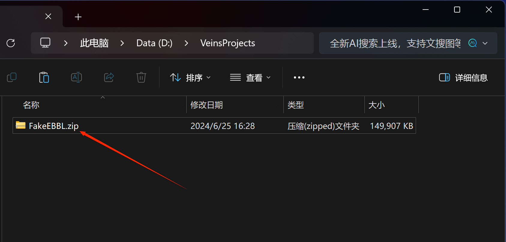

我们可以直接复制压缩包粘贴到Veins指定路径下并解压，如下所示

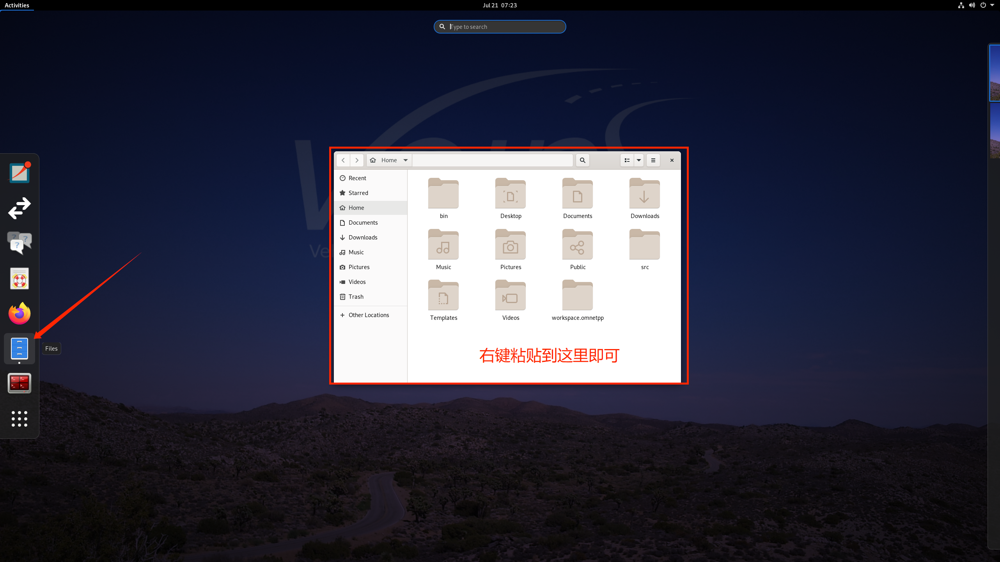
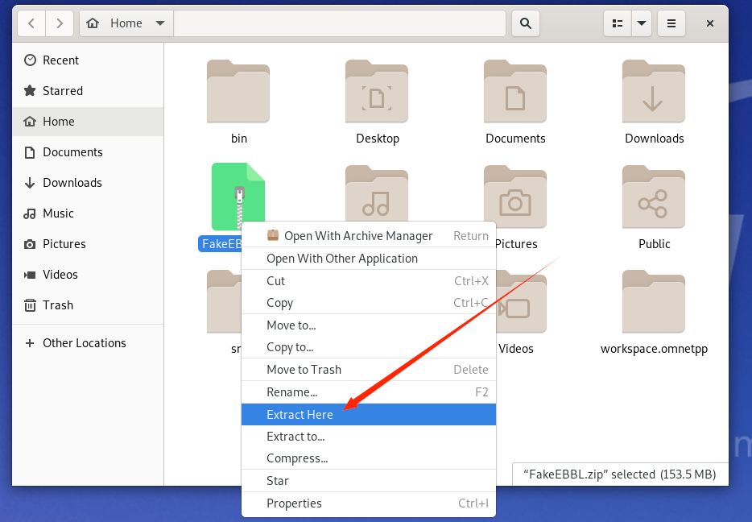

打开`OMNeT++IDE`，同时顺手开启`veins_lanchd`。将先前的项目在`Project Explorer`中`Delete`掉

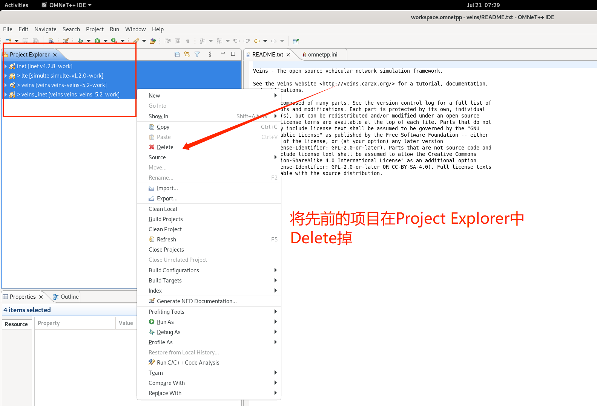

按如下步骤导入项目

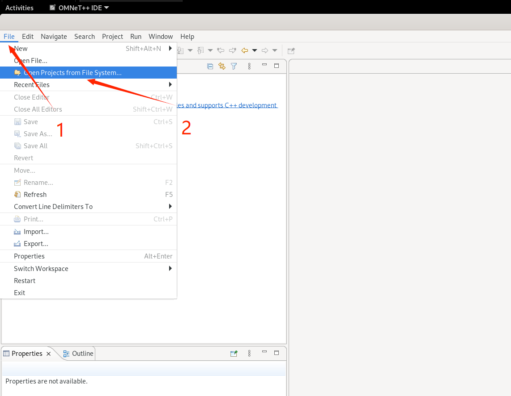
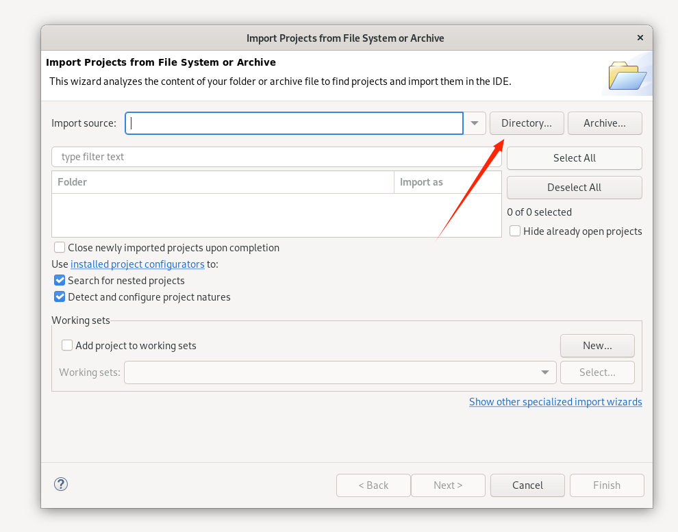
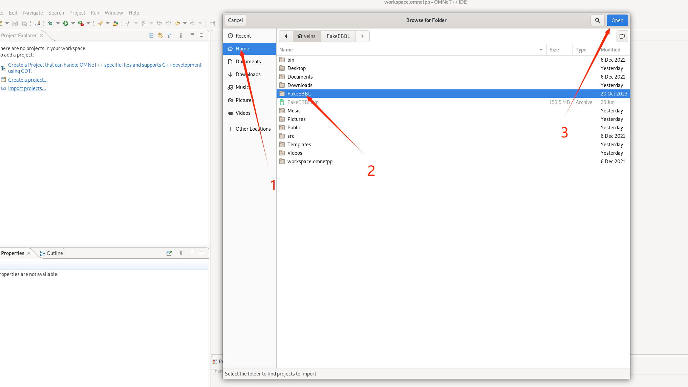
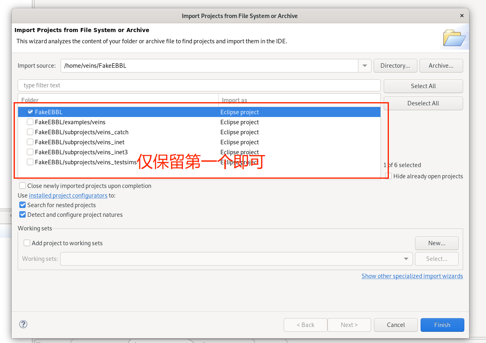

点击`Finish`后项目导入完成。

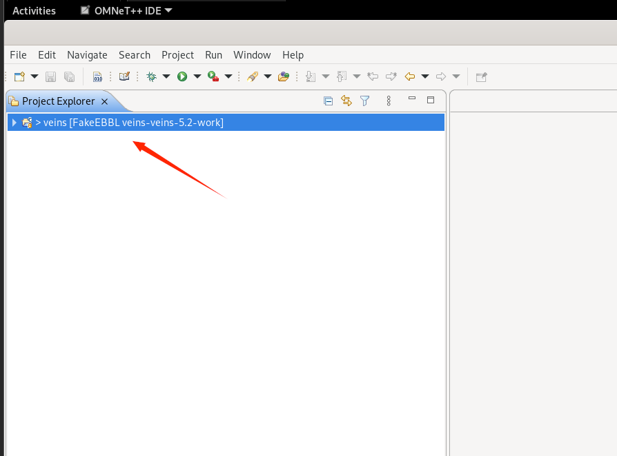

运行测试如下

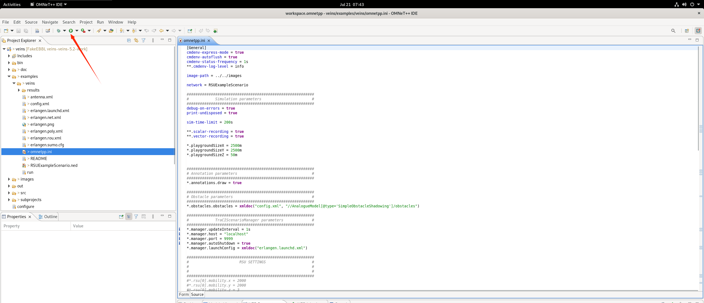
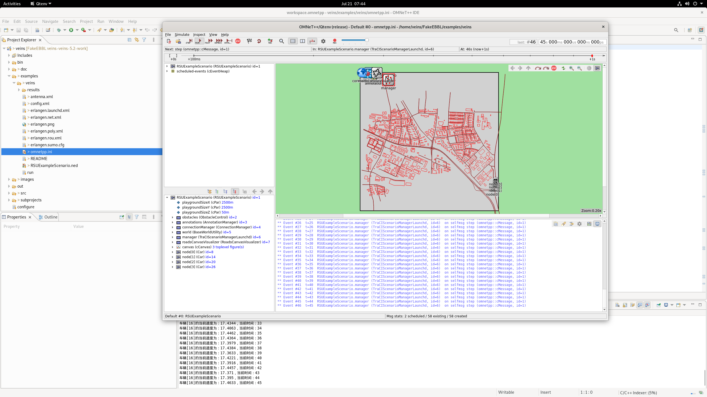

至此，本教程结束。👏 👍

