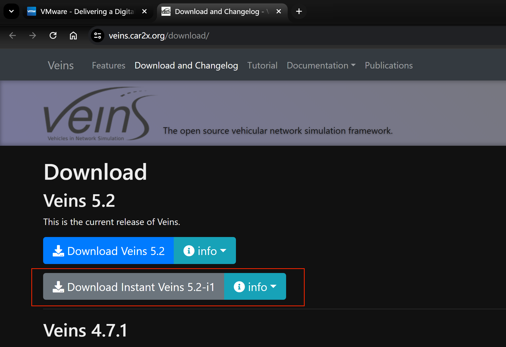

## Veins简易安装教程
刚入门的小伙伴推荐通过该方式安装，方便快速上手。需要下载一个虚拟机`VMware Workstation Pro`和`Veins 5.2-i1`，下载方式如下：

- VMware Workstation Pro可以通过官网[（https://www.vmware.com/cn.html）](https://www.vmware.com/cn.html)下载，也可以通过微信公共号【软件共享管家】等下载，激活密钥可以在网上白嫖；

- Veins 5.2-i1通过官网（[https://veins.car2x.org/download/](https://veins.car2x.org/download/)）下载即可。

下载完成后右键，使用VMware Workstation Pro打开

设置存放路径，点击`导入`

此时可能会出现导入失败提示，点击`重试`即可

导入成功后，点击`开启虚拟机`，选择`否`

初始密码默认为：veins

至此，Veins就安装完成啦~

接下来我们来运行一下示例代码测试，点击`Activities`->`OMNeT++IDE`

根据下图运行，`OK`->`Yes`->`OK`->`RUN`

此时会出现如下错误，Could not connect to TraCI server; error message: 111: Connection refused -- in module (veins::TraCIScenarioManagerLaunchd) RSUExampleScenario.manager (id=6), at t=0s, event #1

这是因为我们没有打开 Veins 模拟框架中用于自动化地管理和启动 SUMO 的一个组件`veins_lanchd`，如下图打开即可

注意，运行过程中`veins_lanchd`不能关闭。我们再次点击运行，最终效果如下，说明我们的veins安装是没有问题的。

## Veins自定义版本安装教程
随着研究的不断深入，上述版本可能并不适用所有项目，所以需要自定义Veins版本安装。安装教程可参考👉[Ubuntu 下 Veins5.2 安装教程](https://github.com/Yrongovo/Veins5.2-Ubuntu18.04-Installation-Guide)，这里就不再赘述了。

至此，本教程结束。👏 👍